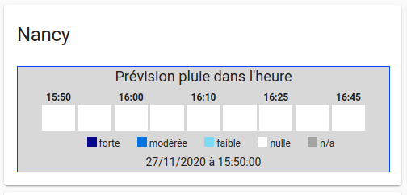
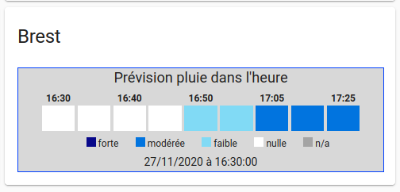
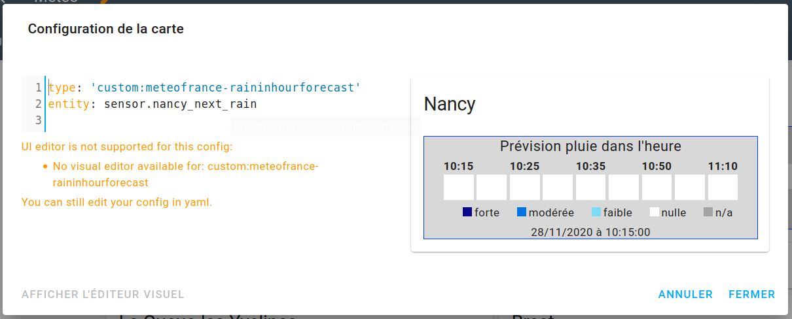

# rainInHourForecast card

Cette carte affiche la prévision de pluie dans l'heure en s'appuyant sur l'entité **sensor.<VILLE>_next_rain** de l'intégration **meteo-france**




## Installation

### Copie du fichier

Copie du fichier `meteofrance-raininhourforecast.js` du dépot dans `<config directory>/www/meteofrance/` de l'instance Home Assistant.

**Example:**

```bash
$ cd <config directory>/
$ mkdir -p www/meteofrance
$ cd www/meteofrance
$ wget https://github.com/vdomos/homeassistant-raininhourforecast-card/raw/master/meteofrance-raininhourforecast.js
```

### Configuration de la ressource

Faire le lien de la ressource *js* dans votre configuration `configuration.yaml`.

```yaml
lovelace:
  mode: yaml
  resources:
    - url: /local/meteofrance/meteofrance-raininhourforecast.js
      type: module
```
> Redémarrer HA


### Ajout de la "custom-card" 

Ajouter la nouvelle "card" dans la GUI home-assistant en ajoutant une carte *custom-card*.


**Example:**

```yaml
type: 'custom:meteofrance-raininhourforecast'
entity: sensor.nancy_next_rain
```




